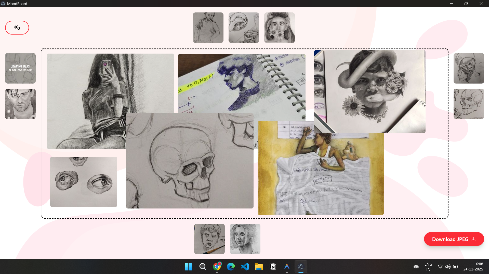
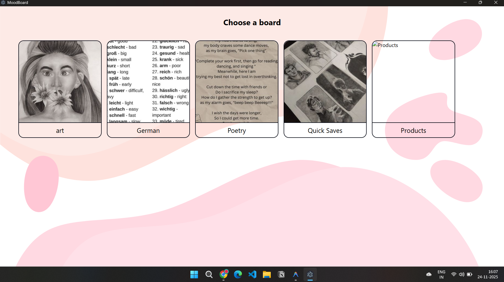

# MoodBoard Desktop App
Create vision boards with an Electron + React experience tailored for offline-friendly inspiration boards.

## Screenshots

| Create Board | Manage Boards |
| --- | --- |
|  |  |

## Download

- Windows (x64) portable build: [moodboard 0.0.0](https://github.com/Himanshu7617/MoodPinBoard/releases/download/v1/moodboard.0.0.0.exe)

## Local development setup

1. **Install prerequisites**
   - Node.js 18+
   - npm 9+
2. **Install dependencies**
   ```powershell
   npm install
   ```
3. **Run the Electron shell with the React UI**
   ```powershell
   npm run dev:electron
   ```
4. **Run only the React renderer (optional)**
   ```powershell
   npm run dev:react
   ```
5. **Create production assets + installer**
   ```powershell
   npm run transpile:electron
   npm run build
   npm run dist:win   # replace with dist:mac or dist:linux as needed
   ```

## Folder layout

```
app/
├── dist-electron/    # Transpiled main/preload files
├── dist-react/       # Vite build artifacts for the renderer
├── src/
│   ├── electron/     # Main process, preload scripts, utilities
│   └── ui/           # React components, pages, contexts, assets
├── electron-builder.json
├── package.json
└── README.md         # This file
```

## Key features

- Multiple mood boards with drag-and-drop layouts
- Local persistence via Electron Store for offline access
- React UI powered by Vite for fast iteration
- Cross-platform builds through Electron Builder
